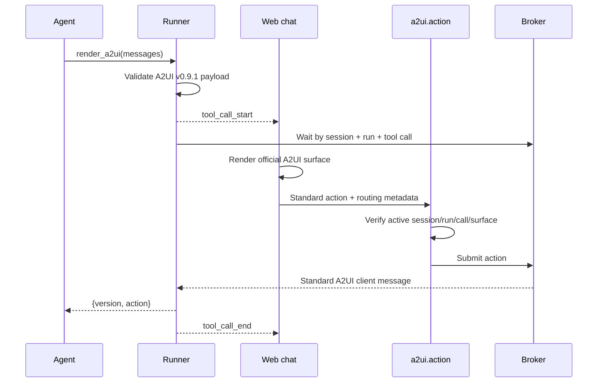

# Generative UI with A2UI

Chelix chat supports declarative, interactive agent-generated interfaces through
[A2UI](https://a2ui.org/). The built-in `render_a2ui` tool accepts A2UI server
messages, renders them in the web chat with the official Lit renderer, waits for
one standard A2UI event action, and returns that action to the agent loop.

Chelix implements the following fixed profile:

| Property | Value |
| --- | --- |
| Protocol | A2UI `v0.9.1` |
| Catalog | `https://a2ui.org/specification/v0_9/catalogs/basic/catalog.json` |
| Renderer | `@a2ui/lit` with `@a2ui/web_core` v0.9 APIs |
| Agent tool | `render_a2ui` |
| Action RPC | `a2ui.action` over the existing authenticated WebSocket |
| Interactive client | Chelix web chat |

A2UI is declarative. Agent output selects components from the trusted basic
catalog and supplies data; it does not provide executable HTML, JavaScript, or
custom web components. Chelix keeps its existing WebSocket JSON-RPC transport:
A2UI defines the UI messages and user action, not a replacement chat transport.

An A2UI call uses the same compact tool card as every other tool. The card keeps
its standard **Parameters**, **Result**, **Raw result payload**, and **Context
budget** disclosures, and the live surface is rendered in an additional
**Interface · A2UI v0.9.1** section above the result. A renderer failure replaces
only that section, so the persisted request and response always stay visible.

Official protocol references:

- [What is A2UI?](https://a2ui.org/introduction/what-is-a2ui)
- [Messages](https://a2ui.org/reference/messages)
- [Components](https://a2ui.org/concepts/components)
- [Actions and data binding](https://a2ui.org/concepts/actions)
- [Catalogs](https://a2ui.org/concepts/catalogs)

## User experience

A normal interaction follows this lifecycle:

1. The agent calls `render_a2ui` with one surface and a timeout.
2. Chelix validates the complete payload before announcing that the tool has
   started. Invalid calls are shown as **needs retry** and are returned to the
   model with a precise validation error.
3. The web chat mounts the official `<a2ui-surface>` renderer. The card shows
   **waiting for response** while its controls are active.
4. A user action changes the card to **submitting**, then **response sent**.
5. The gateway verifies the active session, run, tool call, and surface before
   delivering the standard action to the waiting tool.
6. `render_a2ui` returns `{ "version": "v0.9.1", "action": ... }` to the
   agent. The controls become read-only and the agent continues its normal loop.

A completed surface remains visible in session history, but restored historical
surfaces are read-only. A malformed or rejected historical call displays its
stored validation error instead of attempting to initialize a renderer.



## Calling `render_a2ui`

The tool has one public parameter, `messages`: between 1 and 64 A2UI
server-to-client messages for one surface.

There is no deadline. The call waits until the user acts on the surface, so an
operator who is away from the chat can answer hours later. Stopping the run ends
the wait.

When tool registry mode is `lazy`, the agent first calls
`get_tool(name="render_a2ui")` once to reveal this schema, then calls
`render_a2ui` directly. See [Lazy Registry Mode](tool-registry.md#lazy-registry-mode).

### Minimal interactive surface

The first message creates the surface. A later `updateComponents` message
provides a flat adjacency list: layout components refer to separately declared
children by ID, and button-specific fields sit beside `id` and `component`.

The component with `"id": "root"` is the entry point. The renderer draws that
component and everything it references, so a component that nothing reaches
from `root` never appears. An interaction without a `root` component is
rejected.

```json
{
  "messages": [
    {
      "version": "v0.9.1",
      "createSurface": {
        "surfaceId": "confirm-order",
        "catalogId": "https://a2ui.org/specification/v0_9/catalogs/basic/catalog.json"
      }
    },
    {
      "version": "v0.9.1",
      "updateComponents": {
        "surfaceId": "confirm-order",
        "components": [
          {
            "id": "root",
            "component": "Card",
            "child": "content"
          },
          {
            "id": "content",
            "component": "Column",
            "children": ["question", "confirm-button"]
          },
          {
            "id": "question",
            "component": "Text",
            "text": "Confirm this order?",
            "variant": "h3"
          },
          {
            "id": "confirm-button",
            "component": "Button",
            "child": "confirm-label",
            "variant": "primary",
            "action": {
              "event": {
                "name": "confirm",
                "context": {
                  "approved": true
                }
              }
            }
          },
          {
            "id": "confirm-label",
            "component": "Text",
            "text": "Confirm"
          }
        ]
      }
    }
  ]
}
```

Do not use the legacy v0.8 fields `surfaceUpdate`, `dataModelUpdate`, or
`beginRendering`. Do not wrap component-specific fields in `properties`, and do
not define child component objects inline.

### Message rules

Chelix enforces these rules before starting the tool:

- every message uses exactly `"version": "v0.9.1"`, including the leading
  `v`;
- each message contains exactly one standard message field:
  `createSurface`, `updateComponents`, `updateDataModel`, or `deleteSurface`;
- the first message is `createSurface` with the exact trusted catalog ID;
- one interaction contains exactly one `createSurface`;
- every message targets the same `surfaceId`;
- at least one component is defined;
- exactly one component has `"id": "root"`;
- at least one component has a non-empty `action.event.name`;
- `deleteSurface` is rejected because the surface must remain available while
  the tool waits for an action;
- component-specific properties are flat;
- unknown component names are rejected;
- every component carries the fields the official basic catalog requires for
  it;
- `Image`, `Video`, and `AudioPlayer` reference a media source the chat page
  can actually load.

### Required fields per component

A component that is missing a required catalog field is silently dropped by the
official renderer, so Chelix refuses the call instead.

| Component | Required fields |
| --- | --- |
| `Text` | `text` |
| `Image`, `Video`, `AudioPlayer` | `url` |
| `Icon` | `name` |
| `Row`, `Column`, `List` | `children` |
| `Card` | `child` |
| `Button` | `child`, `action` |
| `Tabs` | `tabs` |
| `Modal` | `trigger`, `content` |
| `TextField` | `label` |
| `CheckBox` | `label`, `value` |
| `ChoicePicker` | `options`, `value` |
| `Slider` | `max`, `value` |
| `DateTimeInput` | `value` |
| `Divider` | none |

### Media sources

`Image`, `Video`, and `AudioPlayer` render a real browser ``, `<video>`, or
`<audio>` element from `url`. Chelix accepts:

- an `https:` URL;
- a `data:` URL;
- a root-relative chat path such as
  `/api/sessions/<sessionKey>/media/<file>`;
- a standard data binding such as `{ "path": "/photo" }`.

`http:` and every other scheme are refused because the chat content security
policy does not load them. The SPA policy allows `img-src`/`media-src` of
`'self' data: blob: https:`, so an accepted `url` renders the real asset instead
of a broken placeholder.

`updateDataModel` is optional. Use it with standard A2UI data bindings such as
`{ "path": "/field" }` when a control or action context must read mutable
surface data.

### Modal triggers

The official `Modal` component wraps the component referenced by `trigger` in
its own click handler that opens the dialog. If that trigger component also
carries an `action`, one click both opens the dialog and completes the
interaction: the surface locks while the dialog is still open, and nothing
inside `content` can be used.

Chelix refuses such a payload. Use a non-interactive trigger such as `Text`,
`Icon`, or `Card`, and put the acting `Button` inside `content`. The trigger
must reference a component declared in the same interaction.

When an interaction completes or fails, the renderer closes any dialog that is
still open, so a locked surface can never trap the page behind an overlay.

### Control response shapes

Two basic-catalog controls behave differently from what their options suggest:

- `ChoicePicker` always writes the selection back as an **array** of values,
  including for `mutuallyExclusive`. Initialize its bound data-model path with
  an array; a scalar initial value is returned unchanged when the user never
  touches the control.
- `Slider` reports the exact dragged value and does **not** snap it to `step`.
  Treat the returned number as continuous between `min` and `max`.

### Supported basic-catalog components

Chelix accepts these trusted component names:

- layout: `Row`, `Column`, `List`, `Card`, `Tabs`, `Modal`, `Divider`;
- display: `Text`, `Icon`, `Image`, `AudioPlayer`, `Video`;
- input and actions: `Button`, `TextField`, `CheckBox`, `ChoicePicker`,
  `Slider`, `DateTimeInput`.

Properties must match the selected component in the official basic catalog. For
example, a labeled `Button` references one `Text` child by `child`; `Row` and
`Column` use `children`; `Icon` requires a catalog-supported `name`; and the
supported button variants are `default`, `primary`, and `borderless`.

## Action returned to the agent

The renderer emits a standard A2UI client message. A successful tool result has
this shape:

```json
{
  "version": "v0.9.1",
  "action": {
    "name": "confirm",
    "surfaceId": "confirm-order",
    "sourceComponentId": "confirm-button",
    "timestamp": "2026-07-24T10:00:00Z",
    "context": {
      "approved": true
    }
  }
}
```

Chelix requires all five action fields. `timestamp` must be RFC 3339 and
`context` must be an object. The tool returns this message without converting
it to a custom event format.

## Transport and trusted routing

The browser sends the standard message through the authenticated
`a2ui.action` RPC:

```json
{
  "runId": "run-id-from-the-live-card",
  "toolCallId": "tool-call-id-from-the-live-card",
  "message": {
    "version": "v0.9.1",
    "action": {
      "name": "confirm",
      "surfaceId": "confirm-order",
      "sourceComponentId": "confirm-button",
      "timestamp": "2026-07-24T10:00:00Z",
      "context": {
        "approved": true
      }
    }
  }
}
```

`runId` and `toolCallId` are Chelix routing metadata, not fields added to the
A2UI action envelope. The server derives `sessionKey` from the authenticated
WebSocket connection and accepts the action only when all of the following are
true:

- the referenced run and tool call are active in that session;
- the active tool is `render_a2ui`;
- the action `surfaceId` matches the surface declared by that active call;
- no action has already completed the interaction.

The runner injects `_session_key`, `_run_id`, and `_tool_call_id` directly into
the tool execution context. These underscore-prefixed values are stripped from
UI events and model-visible persisted arguments.

## Early actions and ending the wait

Tool start is announced before the async tool future reaches its wait point. To
avoid losing a very fast click, the gateway broker can buffer an action briefly
until the waiter is registered. The broker uses the trusted
`session + run + tool call` key, rejects duplicates, and marks completed
interactions closed.

The wait has no deadline: Chelix never invents an action or continues with a
default choice, so the only way an interaction ends is a real user action or
stopping the run. Stopping the run drops the waiter, and an action that arrives
afterwards is rejected. After completion the surface is locked and a late action
is rejected.

## Persistence and reconnect

A2UI reuses normal chat persistence:

- the assistant tool-call frame stores the public `messages` argument;
- the terminal `tool_result` stores the standard action or explicit error;
- live tool events render the active surface;
- history reconstruction revalidates the stored messages and renders valid
  completed surfaces read-only;
- rejected payloads remain visible with their original parameters and error.

No separate A2UI database or hidden UI-state copy is maintained.

A call refused before execution is persisted exactly like an executed one: its
assistant frame and a `tool_result` record carrying `"rejected": true` are both
written to session history. Reloading the page therefore keeps the muted
**needs retry** card with its original parameters and validation error instead
of silently dropping it. This applies to every tool, not only `render_a2ui`.

## Security limits

Chelix applies protocol and resource limits before rendering or accepting an
action:

| Limit | Value |
| --- | ---: |
| Tool request | 128 KiB |
| Client action | 32 KiB |
| Messages per call | 64 |
| Components per call | 200 |
| JSON depth | 32 |
| JSON nodes | 5,000 |
| One JSON string or key | 16 KiB |
| Identifier length | 128 bytes |
| Early-action entries | 128 |
| Early-action/completion retention | 30 seconds |
| Tool timeout | 1–3,600 seconds |

Only the fixed basic catalog is accepted. Arbitrary catalog URLs, unknown
components, executable markup, and custom JavaScript are refused.

## Troubleshooting

### The card says **needs retry**

The call was rejected before execution. Expand the card and use the exact error
path. Common causes are a missing leading `v`, a missing `catalogId`, a legacy
message name, a nested `properties` object, an unknown component, multiple
surface IDs, or no `action.event.name`.

### `Unable to render A2UI`

The server payload passed Chelix validation but the official renderer rejected a
catalog-specific component property. Check required component fields and enum
values. Examples include an unsupported `Icon.name` value or an unsupported
button variant. The message replaces only the **Interface** section; the
**Parameters** and **Result** disclosures on the same card still show the exact
request and response.

### The card stays on **Loading surface…**

The renderer starts from the component with `"id": "root"` and shows this
placeholder until that component arrives. Chelix rejects an interaction with no
`root` component, so a card stuck here in an existing session comes from a
payload that was accepted before this rule existed. Start a new interaction and
give the entry component the id `root`.

### A media component shows nothing

Confirm that `url` is reachable over `https:` and returns an image, video, or
audio content type. A `http:` URL is refused by the tool, and an `https:` URL
that 404s or is blocked by the remote host still renders an empty element.

### A modal opens but the interaction ends immediately

The trigger component carried an `action`. Chelix now refuses that payload; if
an older session still shows it, start a new interaction with a non-interactive
trigger and the acting `Button` inside `content`.

### `missing trusted '_tool_call_id' execution context`

The running gateway predates the streaming-runner routing fix. Rebuild and
restart Chelix, then create a new interaction. A tool call that already ended in
error cannot be resumed.

### The response says **send failed — retry**

The `a2ui.action` RPC was not accepted. The card unlocks so the action can be
retried. Verify that the browser still has the same active session and that the
run has not completed or timed out.

### The surface is visible but read-only

Historical and completed surfaces are intentionally read-only. Start a new
`render_a2ui` call for another interaction.

### A non-web channel cannot operate the controls

The interactive renderer is implemented in the web chat. Channel adapters can
report tool status, but they do not render A2UI controls. Open the same session
in the web UI before the configured timeout, or avoid calling `render_a2ui` for
a channel-only interaction.

## Implementation map

| Concern | Source |
| --- | --- |
| Protocol validation, limits, broker, tool | `crates/gateway/src/a2ui.rs` |
| Authenticated action RPC | `crates/gateway/src/methods/a2ui.rs` |
| Tool registration | `crates/gateway/src/server/prepare_core/post_state.rs` |
| Chat content security policy | `crates/web/src/templates.rs` |
| Trusted runner context | `crates/agents/src/runner/helpers.rs` |
| Streaming tool execution | `crates/agents/src/runner/streaming.rs` |
| Event forwarding and persistence | `crates/chat/src/run_with_tools.rs` |
| Persisted `rejected` marker | `crates/sessions/src/message.rs` |
| Official Lit renderer and card lifecycle | `crates/web/ui/src/a2ui-renderer.ts` |
| Live tool cards | `crates/web/ui/src/ws/tool-helpers.ts` |
| Live history caching | `crates/web/ui/src/ws/chat-handlers.ts` |
| Persisted history rendering | `crates/web/ui/src/sessions/session-render.ts` |
| Typed RPC contract | `crates/web/ui/src/types/rpc-methods.ts` |

See also [Frontend Architecture](frontend.md),
[Streaming Architecture](streaming.md), and [Tool Registry](tool-registry.md).
